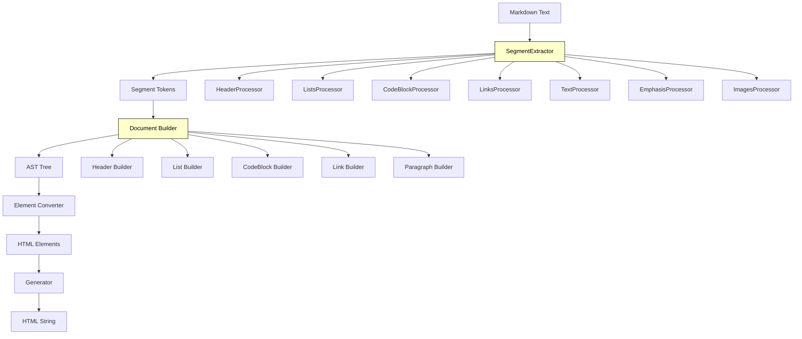

## 🏗️ Architecture



## 📋 Process Flow

### **Step 1: SegmentExtractor** 🔍
**Purpose:** Scans markdown text character by character and identifies patterns

**How it works:**
1. **Buffer Management**: Accumulates input chunks for processing
2. **Character Scanning**: Goes through each character sequentially
3. **Processor Matching**: Tests each character against 12 specialized processors
4. **Priority Processing**: Higher priority processors run first to prevent conflicts

**Key Processors (Priority Order):**
- `EscapedCharProcessor` (highest) - handles `\*`, `\#`, etc.
- `HeaderProcessor` - handles `#`, `##`, `###`
- `ListsProcessor` - handles `-`, `1.`, `*`
- `CodeBlockProcessor` - handles ``` blocks
- `LinksProcessor` - handles `[text](url)`
- `EmphasisProcessor` - handles `**bold**`, `*italic*`
- `ImagesProcessor` - handles ``
- `TextProcessor` (lowest) - handles plain text

**Example:**
```typescript
// Input: "# Hello **World**"
// Character '#' at line start → HeaderProcessor matches
// Output: [{ type: 'HEADER', content: '# Hello **World**' }]
```

### **Step 2: Document Builder** 🏗️
**Purpose:** Converts tokens into Abstract Syntax Tree (AST)

**How it works:**
1. **Token Navigation**: Uses `TokenManager` to traverse tokens
2. **Node Building**: Calls specialized builders based on token type
3. **Recursion Control**: Prevents stack overflow (max depth: 50)
4. **Structure Creation**: Builds hierarchical document tree

**Key Builders:**
- `Header` - builds header nodes with level metadata
- `List` - groups consecutive list items
- `Paragraph` - collects text and emphasis segments
- `CodeBlock` - handles code blocks with language
- `Link` - processes link structures

**Example AST:**
```typescript
{
  type: 'DOCUMENT',
  children: [{
    type: 'HEADER',
    metadata: { level: 1 },
    children: [
      { type: 'TEXT', value: 'Hello ' },
      { type: 'EMPHASIS', value: '**', children: [...] }
    ]
  }]
}
```

### **Step 3: Element Converter** 🔄
**Purpose:** Transforms AST nodes into HTML element structures

**How it works:**
1. **Node Mapping**: Maps each AST node type to HTML element
2. **Attribute Generation**: Creates HTML attributes from metadata
3. **Structure Preservation**: Maintains hierarchical relationships
4. **Type Safety**: Ensures valid HTML element types

**Example Conversion:**
```typescript
// AST Header Node → HTML Element
{
  tag: 'h1',
  children: [
    { tag: 'span', content: 'Hello ' },
    { tag: 'strong', children: [...] }
  ]
}
```

### **Step 4: Generator** ⚡
**Purpose:** Converts HTML element structures into final HTML strings

**How it works:**
1. **String Building**: Recursively builds HTML string
2. **XSS Protection**: Sanitizes content (`<` → `&lt;`, `>` → `&gt;`)
3. **Attribute Handling**: Properly formats attributes
4. **Self-Closing Tags**: Handles `<br/>`, `<hr/>`, ``

**Final Output:**
```html
<h1>Hello <strong>World</strong></h1>
```

## 🔄 Complete Pipeline Example

```typescript
// Input
"# Hello **World**"

// Step 1: SegmentExtractor
[{ type: 'HEADER', content: '# Hello **World**' }]

// Step 2: Document Builder
{
  type: 'DOCUMENT',
  children: [{
    type: 'HEADER',
    metadata: { level: 1 },
    children: [
      { type: 'TEXT', value: 'Hello ' },
      { type: 'EMPHASIS', value: '**', children: [...] }
    ]
  }]
}

// Step 3: Element Converter
{
  tag: 'div',
  attributes: { class: 'markdown-content' },
  children: [{
    tag: 'h1',
    children: [
      { tag: 'span', content: 'Hello ' },
      { tag: 'strong', children: [...] }
    ]
  }]
}

// Step 4: Generator
"<div class=\"markdown-content\"><h1>Hello <strong>World</strong></h1></div>"
```
