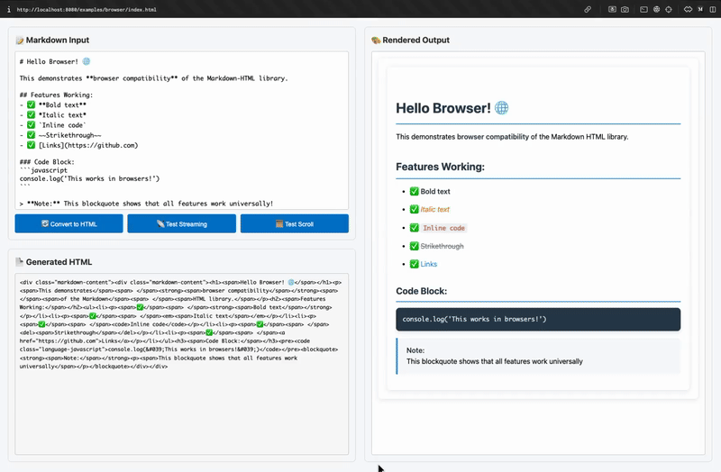

# 📝 Markdown HTML

Converts Markdown text to HTML syntax with TypeScript type safety, streaming support for large documents.

## 🎬 Preview



> *Live demo showing LLM-style streaming markdown to HTML conversion with real-time rendering*

## 📦 Installation

### NPM
```bash
npm install @neabyte/markdown-html
```

### CDN (Browser)
```html
<!-- ES Modules (Recommended) -->
<script type="module">
  import MarkdownHTML from 'https://cdn.jsdelivr.net/npm/@neabyte/markdown-html/+esm'
  // or
  import MarkdownHTML from 'https://esm.sh/@neabyte/markdown-html'
  // or
  import MarkdownHTML from 'https://esm.run/@neabyte/markdown-html'
</script>
```

## 🚀 Quick Start

```typescript
import MarkdownHTML from '@neabyte/markdown-html'

// Simple static API
const html = MarkdownHTML.parse('# Hello **World**')
console.log(html) // <div class="markdown-content"><h1>Hello <strong>World</strong></h1></div>

// With security sanitization enabled
const secureHtml = MarkdownHTML.parse('# Hello **World**', { sanitization: true })

// Streaming API with configurable chunk size and sanitization
MarkdownHTML.stream(markdown, {
  chunkSize: 1000, // 1k-1M characters per chunk
  sanitization: false, // Default: no sanitization
  outputHandler: (chunk) => console.log(chunk),
  errorHandler: (error) => console.error(error)
})
```

---

## 📚 Examples

### 🌐 Browser Example
**Live interactive demo with real-time markdown editing:**
- [Browser Demo](./examples/browser/index.html) - Interactive markdown editor with live HTML preview

### 📦 Node.js Examples

**CommonJS (Traditional Node.js):**
- [CJS Non-Streaming](./examples/cjs/non-stream.js) - Basic usage example
- [CJS Streaming](./examples/cjs/stream.js) - Streaming with handlers

**ES Modules (Modern Node.js):**
- [ESM Non-Streaming](./examples/esm/non-stream.js) - Basic usage example
- [ESM Streaming](./examples/esm/stream.js) - Streaming with handlers

---

## ⚙️ Configurable Chunk Sizes

**Streaming with different chunk sizes for optimal performance:**

```typescript
// Real-time chat (1k chunks)
MarkdownHTML.stream(markdown, {
  chunkSize: 1000,
  outputHandler: (chunk) => updateChat(chunk)
})

// Progressive loading (10k chunks)
MarkdownHTML.stream(markdown, {
  chunkSize: 10000,
  outputHandler: (chunk) => updateUI(chunk)
})

// Batch processing (1M chunks - fastest)
MarkdownHTML.stream(markdown, {
  chunkSize: 1000000,
  outputHandler: (chunk) => processBatch(chunk)
})
```

**Chunk Size Guidelines:**
- **1k-10k**: Real-time applications, chat interfaces
- **10k-100k**: Progressive loading, medium documents
- **100k-1M**: Large documents, batch processing (fastest performance)

## 🛡️ Security & Sanitization

**Optional security features:**

```typescript
// Default behavior (no sanitization)
const html = MarkdownHTML.parse(markdown)
// → Raw HTML output, all URLs allowed

// Security enabled
const secureHtml = MarkdownHTML.parse(markdown, { sanitization: true })
// → XSS protection + URL validation
```

**Security Features:**
- **JavaScript Protocol Blocking**: Removes `javascript:` URLs
- **XSS Protection**: Escapes 20+ dangerous characters (`<`, `>`, `&`, `"`, etc.)
- **Event Handler Removal**: Strips all event handlers (`onclick`, `onerror`, `onload`, etc.)
- **URL Validation**: Only allows safe protocols (`http:`, `https:`, `mailto:`, `tel:`)
- **Path Traversal Prevention**: Blocks **ALL** `../` navigation (zero tolerance)
- **Home Directory Protection**: Blocks `~/` paths to prevent system access

---

## ⚡ Performance

For detailed performance benchmarks, testing methodology, and comparison with other markdown libraries:

- [Performance Benchmarks](./BENCHMARK.md) - Complete performance analysis

---

## 🏗️ Architecture

For detailed information about the internal architecture, processor system, and design decisions:

- [Architecture Documentation](./ARCHITECTURE.md) - Complete technical overview

---

## 📄 License

This project is licensed under the MIT license. See the [LICENSE](LICENSE) file for more info.