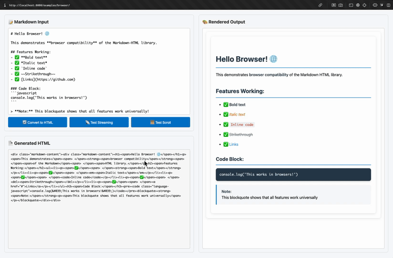

# 📝 Markdown HTML

Converts Markdown text to HTML syntax with TypeScript type safety, streaming support for large documents.

## 🎬 Preview



> *Live demo showing LLM-style streaming markdown to HTML conversion with real-time rendering*

## 🚀 Quick Start

```typescript
import { StreamProcessor } from '@neabyte/markdown-html'

const processor = new StreamProcessor()
const html = processor.processString('# Hello **World**')
console.log(html) // <div class="markdown-content"><h1>Hello <strong>World</strong></h1></div>
```

## 📦 Installation

### NPM
```bash
npm install @neabyte/markdown-html
```

### CDN (Browser)
```html
<!-- ES Modules (Recommended) -->
<script type="module">
  import { StreamProcessor } from 'https://cdn.jsdelivr.net/npm/@neabyte/markdown-html/+esm'
  // or
  import { StreamProcessor } from 'https://esm.sh/@neabyte/markdown-html'
  // or
  import { StreamProcessor } from 'https://esm.run/@neabyte/markdown-html'

  const processor = new StreamProcessor()
  const html = processor.processString('# Hello World')
</script>
```

## 📚 Examples

### 🌐 Browser Example
**Live interactive demo with real-time markdown editing:**
- [Browser Demo](./examples/browser/index.html) - Interactive markdown editor with live HTML preview

### 📦 Node.js Examples

**CommonJS (Traditional Node.js):**
- [CJS Non-Streaming](./examples/cjs/non-stream.js) - Basic usage example
- [CJS Streaming](./examples/cjs/stream.js) - Streaming with handlers

**ES Modules (Modern Node.js):**
- [ESM Non-Streaming](./examples/esm/non-stream.js) - Basic usage example
- [ESM Streaming](./examples/esm/stream.js) - Streaming with handlers

---

## ⚡ Performance

### 📊 Memory Usage Benchmarks

Performance testing with various document sizes shows memory usage patterns:

**Test Environment:**
- **Hardware:** MacBook Pro with Apple M3 Pro chip, 18GB RAM
- **Runtime:** Node.js v22.16.0 on macOS (darwin arm64)
- **Method:** `process.memoryUsage()` with garbage collection enabled

| Document Size | Markdown | HTML Output | Peak Memory | Memory After GC |
|---------------|----------|-------------|-------------|-----------------|
| 19 KB         | 4 MB     | 52 KB       | **6 MB**    | 4 MB            |
| 96 KB         | 5 MB     | 263 KB      | **14 MB**   | 6 MB            |
| 193 KB        | 7 MB     | 526 KB      | **32 MB**   | 9 MB            |
| 392 KB        | 10 MB    | 1058 KB     | **37 MB**   | 12 MB           |
| **9 MB**      | **34 MB**| **19 MB**   | **537 MB** | **132 MB**       |

## 🏗️ Architecture

For detailed information about the internal architecture, processor system, and design decisions:

- [Architecture Documentation](./ARCHITECTURE.md) - Complete technical overview

---

## 📄 License

This project is licensed under the MIT license. See the [LICENSE](LICENSE) file for more info.